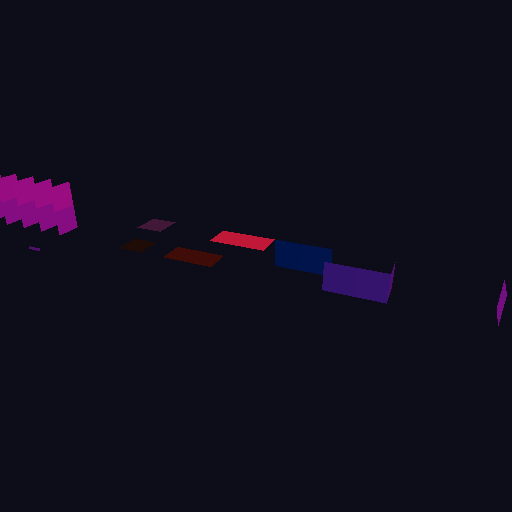
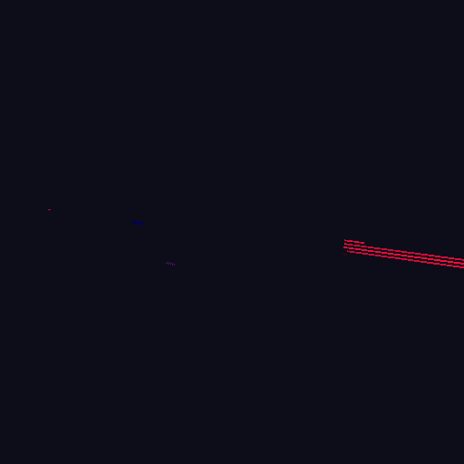
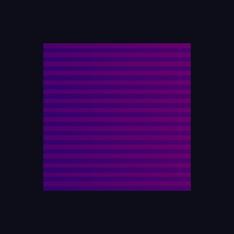

# Phase 4 完了記録 — draw 統合とレンダラ移植

**状態**: 完了。テスト **155 件 PASS / 1 SKIP**、バリデーション指摘ゼロ。
ローダー無しの素の `./gradlew test` でも 153 PASS / 3 SKIP。

> **記録の訂正**: 初版はこの文書を「完了」としつつ temporal パスが未実装だった。
> temporal を実装し、記録を正確にした。

**達成したこと**: 地形描画パイプラインが Vulkan 上で動き、
draw が **セクション単位 → 面/バケット単位に統合**された。

| 至近 (7 面区分すべて) | 俯瞰 | GPU 生成テーブル | cull シーン |
|---|---|---|---|
|  |  |  |  |

---

## 1. 段ごとの結果

| Stage | 内容 | 記録 |
|---|---|---|
| 0 | パイプライン生成 / `dynamic_rendering` / オフスクリーン | `phase4-proposal.md` §6 |
| 1 | 無改造シェーダで絵を出す (CPU 側でコマンド生成) | [`phase4-stage1-completion.md`](phase4-stage1-completion.md) |
| 2a/2b | draw 統合 (13 → 7 draws)、差分ゼロ | [`phase4-stage2-completion.md`](phase4-stage2-completion.md) |
| 3 | prep / cmdgen / prefix sum を GPU へ | [`phase4-stage3-completion.md`](phase4-stage3-completion.md) |
| 4a/4b/4c/4d | 半透明 / cull / 32bit インデックス / temporal | [`phase4-stage4-completion.md`](phase4-stage4-completion.md) |

### 1.1 いま動いているパイプライン

```
frame N
  ① 不透明描画      前フレームのテーブルで 7 draws (+ 分割ぶん)
  ② cull            AABB を深度テスト -> visibilityData
  ③ prep            ディスパッチサイズ / エントリ数 / 半透明カウンタのリセット
  ④ cmdgen          (面, セクション) のテーブル + 半透明の登録と距離バケット計数
  ⑤ merged_prefix   走査 + 面ごとの DrawCommand
  ⑥ temporal_prefix 同じシェーダで temporal テーブルを走査
  ⑦ inital3         1024 バケットの走査
  ⑧ translucent_gen 距離バケット順への並べ替え
  ⑨ translucent_prefix  走査 + バケットごとの DrawCommand
  ⑩ temporal 描画   今フレーム新たに可視になったセクション
  ⑪ 半透明描画      バケット単位の draw、ブレンド有効
```

**GL 側 5 段と 3 つの描画パスをすべて移植済み。**

### 1.2 draw 数

| | GL (現行) | Phase 4 後 |
|---|---:|---:|
| 不透明 | 88,000 | **7** (+ 1M quad ごとに 1 本) |
| temporal | 最大 100,000 | **7** (不透明と同じ形) |
| 半透明 | 最大 100,000 | **最大 1,024** (実際は距離バケットの数だけ) |

上限規模 (537M quad) でも不透明は 519 draws で、
Phase 0 の「1,000 draws 以下なら +0.10ms」の内側に収まる。

---

## 2. Vulkan 専用シェーダ

GL 版 (`lod/gl46/`) は**一切変更していない**。移植先は `lod/vk/`
(一覧は [`phase2-glsl-compat.md`](phase2-glsl-compat.md) §4.6)。

| ファイル | 対応する GL 版 |
|---|---|
| `lod/vk/quads3.vert` | `lod/gl46/quads3.vert` |
| `lod/vk/quad_index.glsl` | (新規。統合テーブルの二分探索) |
| `lod/vk/prep.comp` | `lod/gl46/prep.comp` |
| `lod/vk/cmdgen.comp` | `lod/gl46/cmdgen.comp` |
| `lod/vk/merged_prefix.comp` | (新規) |
| `lod/vk/translucent_gen.comp` | `lod/gl46/buildtranslucents.comp` |
| `lod/vk/translucent_prefix.comp` | (新規) |
| (temporal) | `merged_prefix.comp` を binding だけ変えて 2 本目のパイプラインに。新規ファイルなし |
| `lod/vk/cull_raster.vert` / `.frag` | `lod/gl46/cull/raster.vert` / `.frag` |
| `lod/vk/index_probe.comp` | (テスト専用) |

`util/prefixsum/inital3.comp` は**無改造で流用**した (半透明の距離バケット)。

---

## 3. 見つけて直した不具合 — 8 件

すべて既存コードにあり、絵を出す/検証する作業の中で表に出た。

| # | 箇所 | 内容 |
|---|---|---|
| 1 | `SyntheticTerrain` | 両面/半透明 quad が `faceData[6]` を読む**範囲外アクセス** |
| 2 | `SyntheticTerrain` | quad が重なっていて**索引ずれが絵に出なかった** (基準データとして致命的) |
| 3 | `VkTerrainResources` | アトラスがシェーダの UV 計算と噛み合っていなかった |
| 4 | `writeSimpleModel` | indentation 63 で各面が反対側に貼り付き、内外が裏返っていた |
| 5 | `VkRenderTarget.beginRendering` | src が `TOP_OF_PIPE` で「読み戻し → 再描画」の **WAR に実行依存が無かった** |
| 6 | `ValidationLayerProbeTest` | 存在しないレイヤ名の問い合わせで **JVM ごと SIGSEGV** |
| 7 | `phase4-buffer-hazards.md` §4 | visibility の書き手は**フラグメントシェーダ**。P1 では src が誤り (実地で確認) |
| 8 | `phase4-buffer-hazards.md` §10.2 | 訂正 #4 (prep → cmdgen は P2) が実地で正しかった |

7/8 は対応表の**指摘が正しかったことの確認**で、コードの不具合ではない。

---

## 4. Phase 5 への申し送り

### 4.1 未実装

| 項目 | 備考 |
|---|---|
| **旧経路の削除** | `Mode.PER_SECTION` は GPU 版の参照として残してある。消すかは Phase 5 の判断 |
| **半透明バケットの分割** | 1 バケットが T (1M quad) を超えると切り詰める。検出はできる (`clampedBuckets`) が分割はしていない |
| **HiZ / traversal** | `innerPrimaryWork` の中身。`indirectLookup` は合成データで代用しており、可視セクションの列挙そのものは Phase 5 の範囲 |

### 4.2 ⚠ Phase 5 で初めて問われること

**これまで一度も「GL 版と同じ絵か」を検証していない。**
入力が合成データで、実データはこの環境で得られなかったため
[確認済 — Voxy は GL 4.1 の Mac で起動しない]。

Phase 4 が検証したのは<b>自己整合性</b>だけである:

| 検証した | していない |
|---|---|
| 同じ入力から決定的に同じ絵が出る | **GL 版と同じ絵か** |
| 統合前と統合後が一致する | 実ワールドで正しく見えるか |
| GPU 生成テーブルが CPU 参照とバイト一致 | シェーダの意味論が GL と等価か |

Phase 5 で実データが入ると、この問いが初めて成立する。

### 4.3 実データで最初に疑うべき箇所

Phase 4 で「合成データだから通った」ものを挙げる:

| # | 箇所 | 実データで何が起きうるか |
|---|---|---|
| 1 | **描画順** | 統合で発行順が変わった (セクション順 → 面順)。共平面の quad があると後勝ちの結果が変わる。合成データは規約で共平面を禁じているが、実データには隣接セクションの境界面などがありうる [未検証] |
| 2 | **半透明の重なり** | 規約 2 は合成データ側の制約。実データでは半透明が重なるのが普通で、そのときバケット内の順序が非決定的なぶん<b>絵がフレームごとに揺れる</b>。GL 版も同じ挙動なので「同じ絵か」の比較には<b>バケット単位で比べる</b>などの工夫が要る |
| 3 | **半透明バケットの切り詰め** | `clampedBuckets != 0` になったら分割が要る |
| 4 | **面ごとの quad 数** | T = 1M を超えると分割が走る。合成データでは T を絞って踏ませているが、実データでの分割は [未検証] |
| 5 | **stateId の範囲** | モデルバッファのサイズは合成データの最大 stateId から決めている。実データの `ModelStore` に合わせる必要がある |
| 6 | **バリア** | 「絞っても壊れなかった」までしか言えていない (§4.4) |

### 4.4 バリアの到達点と限界

| Stage | 実在したハザード | 記述 |
|---|---|---|
| 1 | ホスト書き込み → 描画 | 仕様上は省ける (submit の暗黙可視化) が明示的に残した |
| 3 | **前フレームの描画 → 今フレームの生成 (WAR)** | 同一コマンドバッファ内。fence では覆われない |
| 3 | prep → cmdgen (間接ディスパッチ) | 対応表の訂正 #4 が正しかった |
| 4b | cull (FS) → cmdgen (compute) | 対応表 §4 の指摘が正しかった |

**すべて `CONSERVATIVE` と `NARROW` で同じ結果になった。**
ただしこれは十分性の証明ではない:

1. **同期バリデーションがこの環境で機能しない** — 記述漏れを検出する手段が無い
2. in-flight = 1 でフレーム境界は fence が覆う
3. ユニファイドメモリでホスト書き込みの可視化が起きやすい

Phase 5 で interop が入り、GL と Vulkan が同じメモリを触るようになると
**新しい種類のハザードが出る**。そこは Phase 4 の経験が直接は効かない。

---

## 5. 検証の作法 — Phase 4 で確立したもの

### 5.0 「この検査を空虚に満たす方法は何か」

8 例目 (規約の検査が画面外の quad を素通し) を受けて、
temporal では<b>検査を書くたびに抜け道を列挙して塞いだ</b>
([`phase4-stage4-completion.md`](phase4-stage4-completion.md) §6.4)。

空虚に通す典型:

| 型 | 例 |
|---|---|
| 空のデータ | temporal が常に空でも「差分ゼロ」は成立する |
| 0 件のループ | 検査対象が 1 つも無ければ全ての `assertFalse` が通る |
| 画面外 | 描かれない quad はどんな画素検査も通る |
| 一度も成立しない条件 | フィルタが常に真/常に偽なら片側の検査しか効かない |

対策は<b>両方向から挟む</b>こと。temporal なら
「空でない」と「全部でない」、cull なら「落としすぎない」と「落としている」。

### 5.1 規約 2 本 (常設検査)

| # | 規約 | 検査 |
|---|---|---|
| 1 | 各 quad が別々の可視位置を占める | `everyQuadOccupiesADistinctVisiblePosition` |
| 2 | 半透明 quad が画面上で重ならない | `translucentQuadsDoNotOverlapOnScreen` |

どちらも**手順ではなくテスト**にしてある。データセットを足したら
それぞれの一覧 (`namedDatasets()` / `translucentDatasets()`) に登録すること。
詳細は [`phase4-stage1-completion.md`](phase4-stage1-completion.md) §5.1 / §5.1b。

### 5.2 対照実験 — **9 例失敗した**


「検証が実際に機能するか」を対照で確かめる習慣が、Phase 4 で 9 回役に立った
(一覧は [`phase4-stage1-completion.md`](phase4-stage1-completion.md) §5.2)。

壊れ方は 3 種類あった:

| 型 | 例 |
|---|---|
| **検査対象**が壊れていた | z エンコード、quad の重なり |
| **対照そのもの**が無効化されていた | 画面外のエントリを壊していた、密レイアウトで空エントリの境界を壊していた、視錐台の外にずらしていた |
| **テストの前提条件**が壊れていた | `visibilityData` の初期値、規約の検査が画面外を素通し、画素数の閾値が弱すぎた |

3 番目が最も危険で、**「正常に見える」方向に壊れる**。
Phase 5 でも、検証を書いたら必ず
「これが壊れたときにこのテストは落ちるか」「この検査を通る自明な抜け道は何か」を問うこと。

---

## 6. 実行方法

```bash
./gradlew test -PvkLibname=/opt/homebrew/lib/libvulkan.dylib -PvkValidation=true
```

PNG は `build/vk-test-output/` に出る。
`docs/images/` にあるのは記録用の複製。
