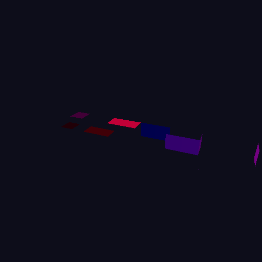

# Phase 5b — interop 画像への描画と GL 側での合成

**状態**: 完了。`./gradlew interopCompositeCheck` が全項目 PASS。
**検査**: [`InteropCompositeCheck`](../src/test/java/me/cortex/voxy/vk/bench/InteropCompositeCheck.java)
**前提調査**: [`phase5b-stencil.md`](phase5b-stencil.md) (ステンシルは要らない)

```bash
./gradlew interopCompositeCheck
./gradlew interopCompositeCheck -PvkLibname=/opt/homebrew/lib/libvulkan.dylib -PvkValidation=true
```

---

## 1. 結論

**Vulkan が IOSurface に直接描き、GL 側で色と深度を合成する経路が動いた。**
結果は Phase 4 のオフスクリーン出力と<b>画素単位でビット一致</b>する。

```
参照経路 (Phase 4):  Vulkan 描画 → 自前 RGBA8 → vkCmdCopyImageToBuffer → 画素
interop 経路 (5b):   Vulkan 描画 → IOSurface(BGRA) ─┐
                     深度解決     → IOSurface(R32F) ─┴→ GL 合成 → GL FBO → glReadPixels → 画素
```

| 検査 | 結果 |
|---|---|
| 色: interop 合成 == Phase 4 オフスクリーン | **差分 0 px** |
| 深度: 解決パス == Vulkan の深度アタッチメント | **差分 0 texel** |
| 深度: `gl_FragDepth` 書き戻し == 解決した深度 | **差分 0 texel** |

<b>この過程で実際にバグを 1 つ踏んだ</b> (上下反転)。差分ゼロ比較では捕まらず、
PNG を目で見て気付いた。§6 に記録する。

---

## 2. 何を作ったか

| 追加 | 場所 | 役割 |
|---|---|---|
| `VkRenderTarget(w, h, externalColor, format)` | main | カラーを外から与えられるようにした。interop 画像をそのまま描画先にする |
| `VkTerrainRenderer(..., colorFormat)` | main | パイプラインのカラーフォーマットを差し替え可能に。**BGRA で描く**ため |
| `VkDepthResolve` | main | D32_SFLOAT の深度を interop の R32F へ写すフルスクリーンパス |
| `lod/vk/depth_resolve.{vert,frag}` | resources | 同上のシェーダ |
| `GlInteropCompositor` | main | GL 側の合成 (色素通し + `gl_FragDepth` 書き戻し) |
| `InteropCompositeCheck` | test (JavaExec) | 上記の検証 |

### 2.1 なぜ深度に「解決パス」が要るのか [確認済 — 仕様ベース]

- IOSurface に depth aspect の面は作れない。使えるのは `'BGRA'` と `'r00f'` だけ
  [確認済 — Phase 0 §8.2]。**深度は色として運ぶしかない**
- `vkCmdCopyImage` は「片方が深度/ステンシル形式なら両方が同一形式」を要求する
  (VUID-vkCmdCopyImage-srcImage-01557)。**D32_SFLOAT → R32_SFLOAT は通らない**

したがってフルスクリーンパスが 1 枚要る。
これは GL 側 `initDepthStencil` の「d32 → d24s8 のフォーマット不一致コピー」の裏返しで、
提案書 §3.1 が「そのまま interop の仕事になる」と書いていたものである。

### 2.2 BGRA で描くこと

IOSurface が受ける色は `'BGRA'` だけなので、Vulkan 側も `B8G8R8A8_UNORM` で描く。
シェーダは変えない — <b>フォーマットがメモリ上の並びを吸収する</b>ので、
書く値も GL から読める値も RGBA のままである。

食い違いは絵が微妙に狂う形でしか出ないため、
`VkTerrainRenderer.record` が<b>描画先とパイプラインのフォーマット一致を実行時に検査</b>する。

---

## 3. バリデーションの既知ノイズを抑制した

Phase 5a §6.3 のとおり、IOSurface backed の画像に触るたびに 3 つの VUID が出続ける。
**この 3 つを、登録済みの interop 画像ハンドルに限って抑制する。**

```
VUID-VkImageViewCreateInfo-image-01020      vkCreateImageView():        used with no memory bound
VUID-VkImageMemoryBarrier-image-01932       vkCmdPipelineBarrier():     used with no memory bound
VUID-vkCmdCopyImageToBuffer-srcImage-07966  vkCmdCopyImageToBuffer():   used with no memory bound
```

**原因**: `VkImportMetalIOSurfaceInfoEXT` で作った画像には `vkBindImageMemory` を呼ばない
(MoltenVK が内部で IOSurface を紐づける)。レイヤは自前でバインドを追跡しているので、
「メモリがバインドされていない」と言い続ける。

### 3.1 抑制の範囲

| | |
|---|---|
| 対象 VUID | **上記 3 つだけ**。`VkContext.INTEROP_NOISE_VUIDS` に明示列挙 |
| 対象ハンドル | `VkInteropImage` が生成時に登録したものだけ。破棄時に外す |
| 通るもの | 同じ VUID でも<b>別のハンドル</b>なら通る。同じハンドルでも<b>別の VUID</b>なら通る |
| 記録 | 抑制した件数とメッセージは `VkContext.suppressedValidationCount()` / `...Messages()` に残る |

[`InteropValidationSuppressionTest`](../src/test/java/me/cortex/voxy/vk/InteropValidationSuppressionTest.java)
が<b>抑制が広すぎないこと</b>を常設で見張る (6 件、素の JVM)。
とくにハンドルの前方一致による誤爆 (`0x30000000003` を登録して `0x300000000031` が巻き添え) を塞いでいる。

### 3.2 いつ外せるか

バリデーションレイヤが IOSurface backed の画像を理解するようになったら、
`INTEROP_NOISE_VUIDS` と登録の仕組みごと消せる。
`interopCompositeCheck` の末尾が抑制件数を出すので、
**0 件になったら外し時**である。

> **却下した案**: ダミーの `VkDeviceMemory` を確保して `vkBindImageMemory` を呼ぶ。
> レイヤは黙るが、MoltenVK が IOSurface とダミーのどちらを使うか分からず、
> 絵が出ないときに原因を切り分けられなくなる。

---

## 4. 同期は `FENCE` 相当で進めている

Vulkan → GL の方向は `VkFrameTracker.waitForFrame()` (フェンス待ち) を使う。
Phase 5a で測った 0.315 ms の待ちがこれにあたる。

GL → Vulkan の方向は 5b では発生しない (GL は読むだけ)。
5c で MC の深度を受け取るときに `glFenceSync` + `glClientWaitSync` を入れる
— 判断は「コスト差 0.3 ms 未満なら正しさが確認できているほうを選ぶ」。

---

## 5. 検証と、その空虚さの塞ぎ方

差分ゼロを主張するには「差分ゼロになる別の理由」を潰さなければならない。

| # | 空虚に満たす方法 | 塞いだ検査 |
|---|---|---|
| C1 | **どちらも背景色だけ** → 一致は自明 | 被覆画素数 > 1000 かつ相異なる色 >= 4 を要求 |
| C2 | **比較が鈍い / 同じものを 2 回読んでいる** | <b>別の視点</b>で描いた結果とは一致しないことを要求 |
| C4 | **深度が壊れていても色が合えば通る** | `gl_FragDepth` を書かない合成で<b>深度検査が落ちること</b>、かつ<b>色検査は通ってしまうこと</b>を両方確認 |
| C5 | **深度が一様で比較に意味が無い** | 相異なる深度値 >= 2、非クリア texel > 1000 を要求 |
| C6 | **R と B が入れ替わっていても気付かない** | まず「絵に R != B の画素があること」(C6a) を確かめ、その上で<b>入れ替えたら落ちること</b>を要求 |
| C7 | **上下が反転していても気付かない** | §6 |

**C4 の後半が重要である。** 「色検査は通ってしまう」ことを明示的に確認しているので、
<b>色検査だけでは深度の破損を捕まえられない</b>という事実が記録として残る。
深度検査を消したら何が失われるかが分かる形になっている。

`GlInteropCompositor.Defect` に、わざと壊した合成 3 種
(`NO_DEPTH` / `SWAPPED_CHANNELS` / `NOT_FLIPPED`) を置いてある。
**本番で `Defect.NONE` 以外を使ってはならない。**

---

## 6. ⚠ 実際に踏んだバグ — 上下反転は差分ゼロ比較で捕まらない

**最初の実装は上下逆さまに合成していた。全検査が PASS していた。**

### 起きていたこと [確認済]

| | 0 行目が指すもの |
|---|---|
| Vulkan の framebuffer | **絵の一番上** (原点は左上。`VkSceneUniform.perspective` が `m[5] = -f` で Vulkan の約束に合わせている) |
| GL の `gl_FragCoord.y` | **下から**数える |
| `glReadPixels` が返す 0 行目 | **絵の一番下** |

合成が `texelFetch(tex, ivec2(gl_FragCoord.xy))` としていたので、
GL の一番下の行に Vulkan の一番上の行が入り、<b>GL のフレームバッファ上では絵が逆さま</b>になっていた。

**それが差分ゼロ比較を通ってしまったのは、`glReadPixels` がもう一度反転するからである。**
反転が 2 回起きて打ち消し合い、配列としては完全に一致する。

```
Vulkan 配列 row 0 (上) ──合成で反転──→ GL fb 一番下 ──glReadPixels で反転──→ 読み戻し row 0
                                                                              ↑ 一致する
```

### 気付いた経緯

**PNG を目で見た。** 参照画像と合成画像を並べたら鏡像だった。
機械的な検査は 10 項目すべて PASS していた。

| 参照 (Phase 4 オフスクリーン) | interop 経由の合成 (修正後) |
|---|---|
|  |  |

### 直した内容と、再発を防ぐ形

1. 合成が `textureSize(colourTex).y - 1 - int(gl_FragCoord.y)` で読み替えるようにした
2. 検査の比較を<b>上下反転して突き合わせる</b>形に変えた
3. **C7** を追加した。わざと反転しない合成 (`Defect.NOT_FLIPPED`) を作り、
   - 反転して比べると<b>落ちること</b>
   - 反転せずに比べると<b>ビット単位で一致してしまうこと</b>

   の両方を要求する。2 つ目は「素通りが本当に起きる」ことの記録であり、
   将来この比較を素朴な形に戻すと落ちる。

### 教訓 — 対照実験の運用に追加する規則 (失敗例 10 例目)

> **打ち消し合う 2 つの変換を含む経路では、端点の一致は何も保証しない。**
> Phase 4 が「検査を書いたら空虚に満たす方法を列挙する」と決めていたが、
> <b>反転の打ち消しは列挙から漏れていた</b>。
> 差分ゼロ比較と目視の両方を残していたことだけが効いた。

これは `phase4-stage1-completion.md` §5.2 の 3 類型のうち
<b>「テストの前提条件」型</b>の新しい形である。運用に 2 つ足す:

1. **「空虚に満たす方法の列挙」は経路の端点だけでなく<b>途中も見る</b>。**
   入力と出力が一致しても、途中に対称な誤りが 2 つあれば通ってしまう。
   経路に座標変換・順序変換・形式変換が入るたびに
   「この変換の逆が経路のどこかに居ないか」を確かめる。

2. **機械的検査だけに寄せない。** 差分ゼロ比較は 10 項目すべて PASS していた。
   気付いたのは PNG を並べて見たからである。
   目視は「検査に落ちない誤り」に対する最後の網であり、外してはならない。

---

## 7. 検証の層 — 「GL は要るが MC は要らない」層が確立した

Phase 5a §7 で見つけた中間層に、5b の検証が乗った。

| 層 | 走らせ方 | 件数 | 自動か |
|---|---|---:|---|
| 素の JVM (JUnit) | `./gradlew test` | **166 PASS / 1 SKIP** | 自動 |
| **GL + Vulkan (JavaExec)** | `./gradlew glToVkSyncBench`<br>`./gradlew interopCompositeCheck` | **2 本** | 自動 (ただし JUnit の外) |
| MC 起動 | `./gradlew runClient` | — | **手動 + スクリーンショット** (5c 以降) |

**なぜ JUnit に入れられないか**: GLFW は macOS で `glfwInit` を
プロセスの main スレッドから呼ぶことを要求する (`-XstartOnFirstThread`)。
Gradle の test worker はテストを "Test worker" スレッドで実行するため満たせない。

`interopCompositeCheck` は失敗時に<b>終了コード 1</b> を返すので、CI のゲートに使える。

166 件の内訳 (Phase 5 で増えた 11 件):
- `StencilMaskEquivalenceTest` 5 件 — ステンシル調査 (phase5b-stencil.md)
- `InteropValidationSuppressionTest` 6 件 — 抑制が広すぎないこと (§3)

---

## 8. 残っている [未検証]

- **GL 版と同じ絵か。** Phase 5 全体の限界 (提案書 §5.6)。
  ここで一致を確認したのは<b>Vulkan の 2 経路どうし</b>であって、GL 版ではない
- **MC のフレームバッファに合成したときの挙動。** 5b はオフスクリーン FBO までである。
  MC 側は d24s8 でサイズもフォーマットも違う
- **リサイズ経路。** `VkInteropImage` の作り直しと GL テクスチャ / IOSurface の解放順は
  実装してあるが、実際に繰り返して壊れないかは確かめていない (提案書 §1.3 の懸念)
- **深度解決パスのコスト。** 512x512 でしか測っていない。
  1920x1080 でフルスクリーンパス 1 枚ぶんの帯域を毎フレーム使う
- **アルファの扱い。** 地形シェーダの出力アルファは面/LoD の符号化なので素通ししているが、
  MC のフレームバッファに合成するときブレンドが要るかは 5c の話
